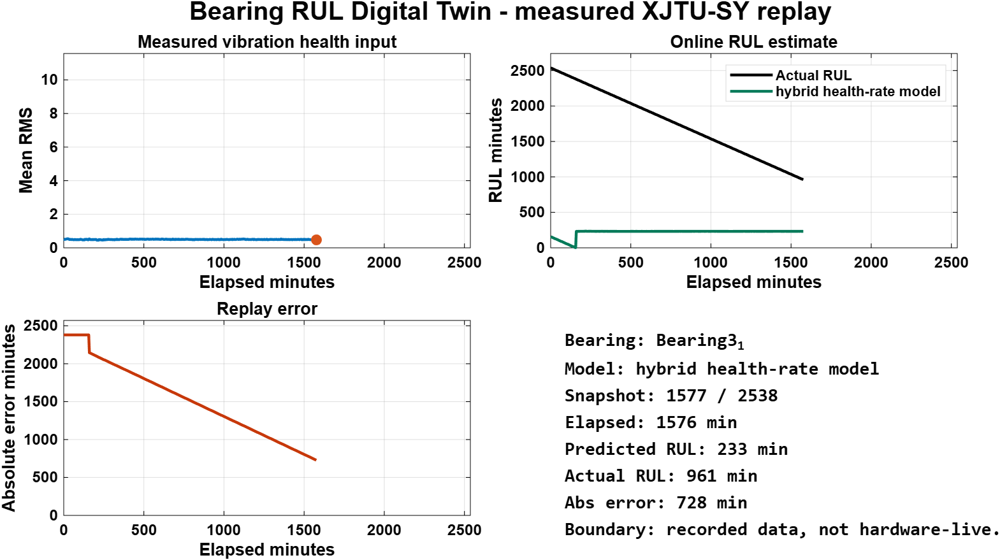
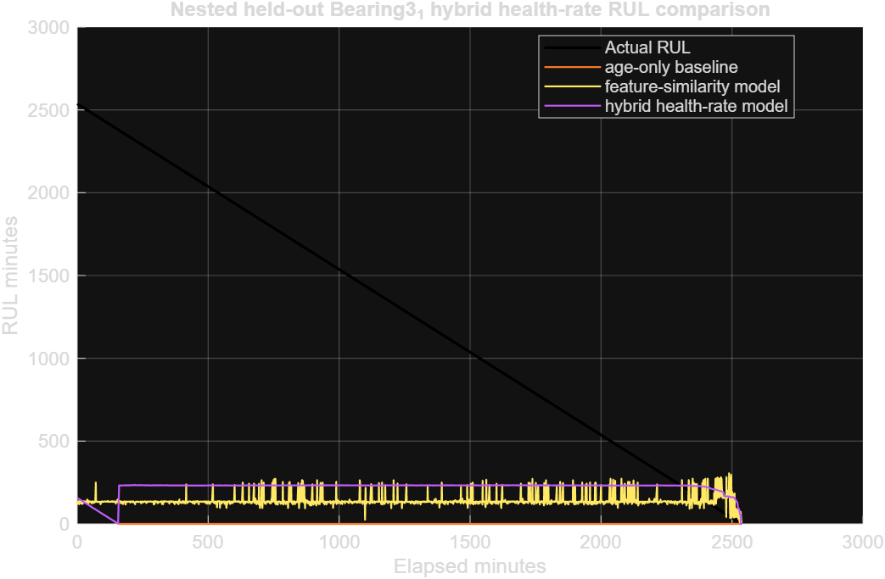
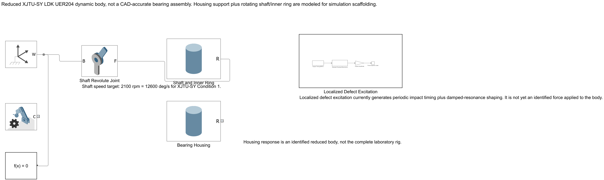
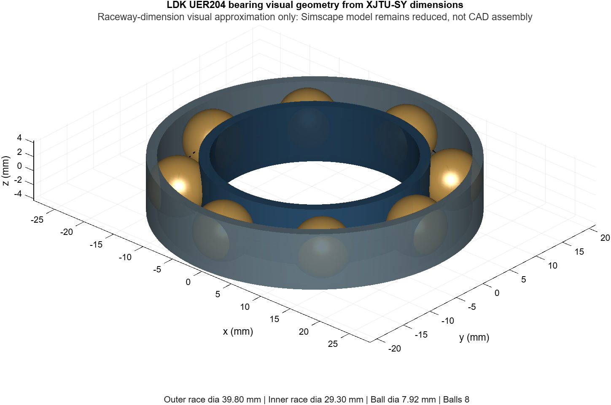
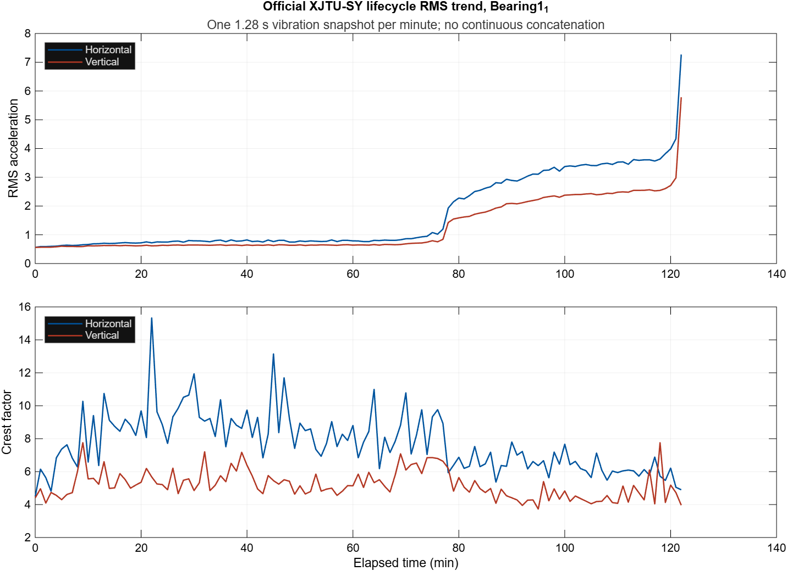

# Bearing RUL Digital Twin MATLAB

MATLAB, Simulink and Simscape project for rolling-element bearing remaining-useful-life estimation. The project combines an audited XJTU-SY measured vibration workflow, leakage-controlled RUL model comparisons, a reduced Simscape bearing body, and an online measured-data replay.

This is a **measured-data digital-twin prototype**, not a deployed factory or hardware-live acquisition system.

## Demo

The replay below uses official XJTU-SY lifecycle feature rows from held-out `Bearing3_1`. The hybrid health-rate model is fit on training bearings only, then predicts each replay prefix as the row arrives.

[Watch the 40 s measured-data replay](docs/assets/bearing_rul_hybrid_live_replay.mp4)





## What is proven

- Official XJTU-SY archive was downloaded, SHA-256 checked and extracted locally.
- The project generated measured lifecycle features for all 9,216 official snapshots.
- Outer-race RUL evaluation uses manifest-derived held-out folds.
- Feature scaling, thresholds, priors and gates are fit on training bearings only.
- The live replay computes predictions online from prefixes, without future held-out rows.
- The public repository tracks source, reports, small evidence assets and manifests, but not raw dataset archives.

## Current result

All three RUL models are evaluated on the same eight outer-race bearings and 3,636 held-out snapshot predictions.

| Model | Protocol | Weighted MAE min | Weighted normalized MAE | Mean per-bearing MAE min |
| --- | ---: | ---: | ---: | ---: |
| Age-only baseline | Nested leave-one-bearing-out | 898.90 | 0.4425 | 201.12 |
| Feature-similarity comparator | Nested leave-one-bearing-out | 860.98 | 0.7080 | 321.80 |
| Hybrid health-rate model | Nested leave-one-bearing-out | 757.05 | 0.3806 | 172.97 |

The hybrid model is the current accepted software gate because it improves weighted, normalized and mean per-bearing error against the age-only baseline. The result is still an accelerated bearing-rig result, not a field-service lifetime claim.

See:

- [`docs/reports/hybrid_health_rate_rul_2026-09-13.md`](docs/reports/hybrid_health_rate_rul_2026-09-13.md)
- [`docs/reports/final_correctness_audit_2026-09-13.md`](docs/reports/final_correctness_audit_2026-09-13.md)
- [`docs/reports/public_release_scorecard_2026-09-14.md`](docs/reports/public_release_scorecard_2026-09-14.md)

## Simscape body and bearing geometry

The Simscape model is a reduced dynamic scaffold: world frame, solver configuration, revolute shaft and separated housing body. It is useful for integration structure, fault-injection placement and future transfer-path identification. It is not a CAD-accurate bearing assembly and does not by itself reproduce spall-growth physics.



The geometry visualization below uses the audited LDK UER204 dimensions from `docs/data/xjtu_sy_bearing_geometry.csv`.



## Data boundary

Raw XJTU-SY archives and extracted CSVs are intentionally ignored by Git. The repository includes:

- source ledger: [`docs/data/source_ledger.csv`](docs/data/source_ledger.csv)
- official archive audit: [`docs/data/data_access_audit.md`](docs/data/data_access_audit.md)
- official part metadata: [`docs/data/xjtu_sy_official_mediafire_parts.csv`](docs/data/xjtu_sy_official_mediafire_parts.csv)
- lifecycle manifest: [`docs/data/xjtu_sy_lifecycle_manifest.csv`](docs/data/xjtu_sy_lifecycle_manifest.csv)
- tracked reports and small visual evidence in `docs/assets`



## Reproduce

MATLAB R2026a was used for the checked local run. Required products for the full project are MATLAB, Simulink, Simscape, Signal Processing Toolbox, Statistics and Machine Learning Toolbox, and Predictive Maintenance Toolbox.

Run the public CI-safe gate:

```powershell
& 'C:\Program Files\MATLAB\R2026a\bin\matlab.exe' -batch "run('scripts/run_public_ci_checks.m')"
```

Run the reliable local software gate, excluding the Simscape browser-stability case:

```powershell
& 'C:\Program Files\MATLAB\R2026a\bin\matlab.exe' -batch "addpath(genpath('src')); files = dir(fullfile('tests','Test*.m')); files = files(~strcmp({files.name}, 'TestSimscapeBody.m')); suites = cell(numel(files), 1); for idx = 1:numel(files), suites{idx} = matlab.unittest.TestSuite.fromFile(fullfile(files(idx).folder, files(idx).name)); end; suite = [suites{:}]; results = run(suite); assertSuccess(results);"
```

Regenerate the hybrid model report artifacts after placing the verified XJTU-SY extraction under the ignored raw-data folder:

```powershell
& 'C:\Program Files\MATLAB\R2026a\bin\matlab.exe' -batch "run('scripts/summarize_official_lifecycles.m')"
& 'C:\Program Files\MATLAB\R2026a\bin\matlab.exe' -batch "run('scripts/run_hybrid_health_rate_rul_model.m')"
& 'C:\Program Files\MATLAB\R2026a\bin\matlab.exe' -batch "run('scripts/export_web_demo_assets.m')"
```

Open the measured-data replay in MATLAB:

```powershell
& 'C:\Program Files\MATLAB\R2026a\bin\matlab.exe' -r "cd('E:\Projects\bearing-rul-digital-twin-matlab'); run('scripts/show_live_rul_replay.m')"
```

## Repository layout

- `src/data`: dataset and manifest loading utilities
- `src/features`: measured vibration feature extraction
- `src/modeling`: baseline, feature-similarity and hybrid RUL models
- `src/physics`: bearing geometry, characteristic frequencies and defect excitation
- `models`: reduced Simscape model
- `scripts`: reproducibility and visualization entrypoints
- `tests`: MATLAB unit and artifact tests
- `docs/data`: source ledger, manifests and data access audit
- `docs/model`: evaluation protocol and claim boundaries
- `docs/reports`: evaluation reports and release evidence
- `docs/assets`: small public plots and demo video

## Correct claim

Use this wording publicly:

> Built a MATLAB/Simscape bearing RUL prototype calibrated and evaluated on official XJTU-SY measured lifecycle data. The hybrid health-rate estimator improved held-out outer-race RUL error versus an age-only baseline, while preserving explicit accelerated-test and hardware-live claim boundaries.

Do not claim:

- deployed factory predictive maintenance
- live hardware DAQ, serial or OPC UA acquisition
- field-service lifetime prediction
- complete XJTU-SY rig replication
- conveyor, robot-joint or BMW production RUL accuracy

## Licence

MIT, see [LICENSE](LICENSE). It covers the code, models and documentation in
this repository. It does not cover the XJTU-SY bearing dataset, which is
published by its own authors under their own terms and is not redistributed
here.
